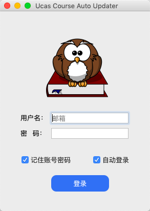
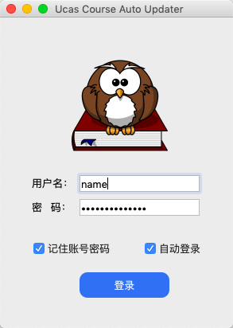
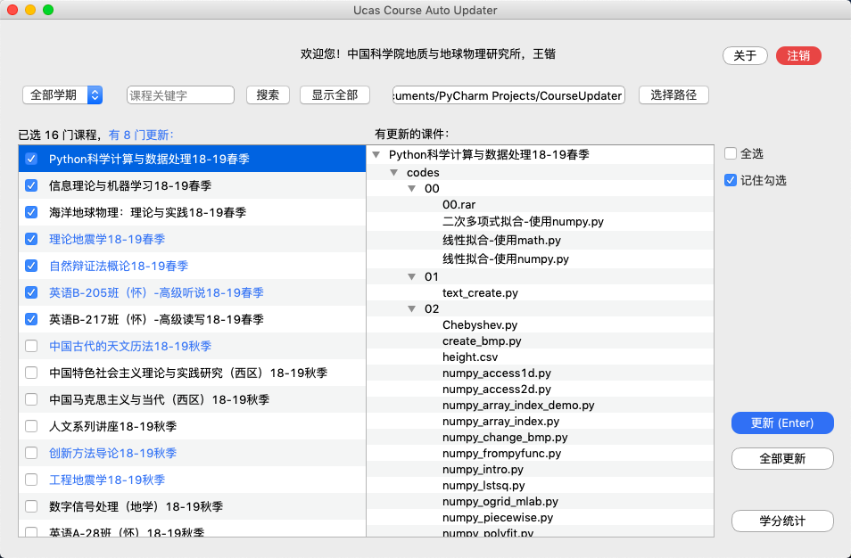

# 中国科学院大学课件自动同步软件
## 简介
这是一个基于 Python3 + requests-html + PyQt5 设计的一个 GUI 软件，它的功能是自动同步更新国科大课件。它可以运行于 Windows、macOS 和 Linux 平台。如果需要，你也可以使用 PyInstaller 将这个软件打包到任何一个操作系统平台作为应用程序使用。

用户使用国科大信息门户的账号、密码登录，选课信息将以列表形式显示，有课件更新的课程以蓝色文字突出显示，并显示所有更新的课件。用户可以根据需要选择需要更新的课程，按下“Enter”键即可更新。

用户可以设置课件存放路径，能够进行课程关键字查询，也可以记住自己已经个勾选的课程，下次启动软件时不需要再次勾选。

这个软件设计的初衷是尽可能减少使用者的操作，因此你只需要登录一次，以后打开软件只需要“Enter”键更新即可。同时，用户第一次登录时软件会默认为你勾选本学期的课程，其目的是减少用户的操作。用户信息不会被收集，这一点你可以从源代码中看出来，同时，用户信息不会以文本形式保存，不必担心密码被轻易泄露，当然，如果你选择不记住账号密码，那么你的账号信息将不会被保存在你的计算机。

## 致谢
软件有关网络爬虫的部分借鉴或采用了 [libowei1213 @ github.com](https://github.com/libowei1213/CoursewareDownload) 的代码，他的工作是该项目的灵感与前提。

## 软件功能
1. 自动登录课程网站，只需输入一次账号密码，可以选择记住账号密码或者自动登录；
2. 可以注销账号，重新登录其他账号，不必退出软件；
3. 可以按学期/课程关键字搜索课程，下载相应的课件；
4. 可以指定课件下载目录，同样，下载目录只需选择一次，因此无论软件存放在哪里都不会影响课件的更新与下载；
5. 自动新建与课程网站相同的文件目录，不必手动新建文件夹；
6. 自动判断有更新的课件，并将其用文件目录的形式显示，有课件更新的课程会用蓝色文字突出显示；
7. 可以选择更新勾选的课程，或者更新全部课程；
8. 可以全选或者全不选，也可以记住已经勾选的课程，下次程序运行时将保持勾选状态；
9. 软件提供了一些常见的异常提示，以保证程序运行的稳健性。

## 软件使用

### 环境
- Python 3.x
- requests-html
- PyQt5

### 环境配置
安装 Python 3.x，可以到 [Python 官网](https://www.python.org/downloads/) 下载安装包进行安装。

配置 requests-html 和 PyQt5：

```
pip3 install requests-html
pip3 install PyQt5
```

### 运行软件

在脚本所在目录按打开命令窗口/终端，执行命令：

```
python mainUpdater.py
```

第一次运行会出现登录界面：

 

按提示登录后即可进入软件界面：



现在你可以根据自己的需要下载你的课件。

## 更新日志
- 2019.03.24 发布 V1.0 版本